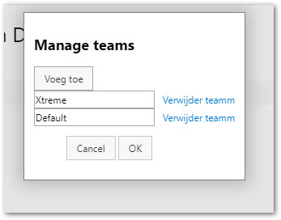
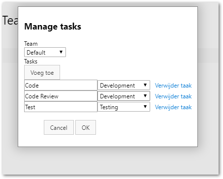
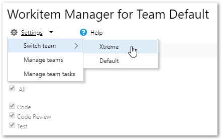
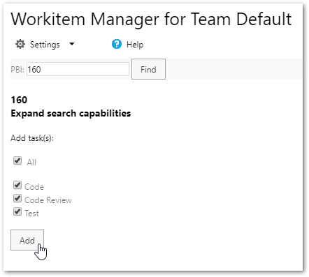


Working with tasks is a great way to manage progress in your scrum process. 
Adding tasks to workitems is boring and a waste of time.
Work item Manager (WiM) helps you with adding recurring tasks to workitems like Bugs or Product Backlog Items.

After installing the extension you can add -in one click- one or more preconfigured tasks to existing workitems
## How to use
Configure one or more teams.
 

Configure per team a set of tasks that you repeatedly want to bind to workitems.

WiM stores your configuration as Azure DevOps settings.

Choose your team. 

Then, just select a workitem based on the workitem-ID and click add.

## Constraints
Before adding tasks to a workitem, WiM checks automatically the relation structure between the artifacts to bind. 

It is not possible to create a parent-child releation between tasks.  
Tasks can only be added to workitems of the type Bug or Product Backlog Item.

## Get the source
The source for this extension is on [GitHub](https://github.com/kryban/WiM/tree/master/WiM/Wim.Ext). 

Take, fork, extend, but before all... contribute.

## Contribute
This extension was created by [bandik](mailto:kry.ban@gmail.com?subject=[GitHub]%20WiM%20) with help from the community. 
I really appreciate any useful contribution.

## Feedback and issues
If you have feedback or issues, please send an email or file an issue on GitHub